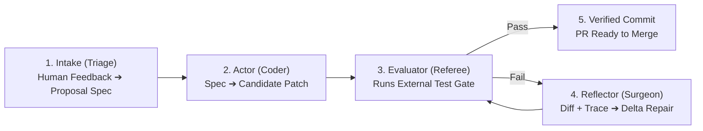

# Autonomous Engineering Harness (The Cybernetic Closed Loop)

A portable, domain-agnostic software engineering controller built on **Donella Meadows' Systems Thinking** and the **Reflexion Architecture** (Shinn et al.).

---

## 1. The Core Problem Solved

Traditional AI coding agents conflate **Code Generation** and **Test Evaluation** into a single black box:
* When tests fail, agents often perform emergency wipeouts (`git reset --hard`).
* This destroys the candidate patch (evidence stock).
* The healing agent wakes up with an empty workspace, sees tests passing on the baseline, and falsely declares victory while the user's requested feature is lost.

This harness **decouples the Controller from the Plant**, enforcing that **state is never destroyed on failure**.

---

## 2. The 5-Phase Architecture



| Phase | Component | Input | Output | Invariant |
| :--- | :--- | :--- | :--- | :--- |
| **1. Intake** | `src/triage.ts` | Raw issues/feedback | Structured Spec + PR Checkbox | Strips noise; groups related items into an atomic unit. |
| **2. Actor** | `src/coder.ts` | Approved Proposal Spec | Candidate Patch (Diff) | Paced turns (4s); commits WIP checkpoint on failure (no reset). |
| **3. Evaluator** | `src/evaluator.ts` | Workspace code | Pass/Fail + Full Trace | External referee. Verifies target feature files were modified. |
| **4. Reflector** | `src/surgeon.ts` | Spec + Patch Diff + Trace | Delta Repair Patch + RCA | Fixes failing lines directly; never starts from an empty slate. |
| **5. Delivery** | GitHub Actions | Healed Branch | 1-Tap Merge on Phone | Green checkmark waiting for user approval. |

---

## 3. How to Connect to ANY Repository (Work or Personal)

The harness has **zero dependencies** on React, Next.js, or any specific product domain. To drop this into another repository (e.g. a MATLAB toolbox, a C++ project, or a Python service):

1. Place the `.harness/` directory in the repository root.
2. Edit `.harness/config.json`:
   ```json
   {
     "project": { "name": "matlab-graphics-pipeline" },
     "evaluation": {
       "testCommand": "matlab -batch \"results = runtests; assertSuccess(results);\""
     }
   }
   ```
3. Add the GitHub Action / GitLab CI runners that invoke:
   - `npx tsx .harness/bin/run-triage.ts`
   - `npx tsx .harness/bin/run-coder.ts --pr <PR_NUMBER>`
   - `npx tsx .harness/bin/run-surgeon.ts --pr <PR_NUMBER>`

---

## 4. Systems Thinking Invariants (Donella Meadows)

* **Anti-Rule Beating**: The evaluator checks `git diff`. A test run that passes without touching feature files is rejected as a failure.
* **Preserved State**: Candidate diffs are committed to git history before calling the Surgeon.
* **Quota Protection**: Inter-turn pacing and exponential backoff prevent blowing API limits.

