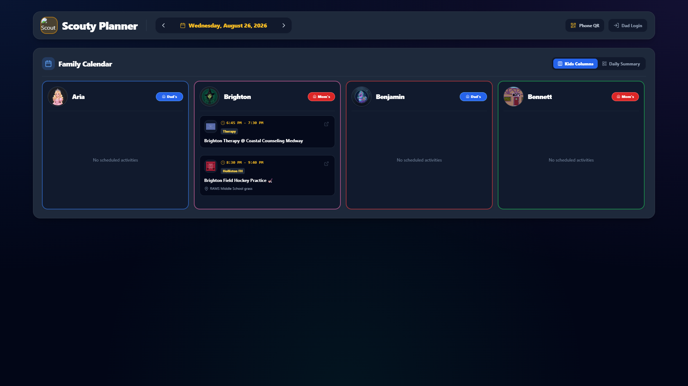
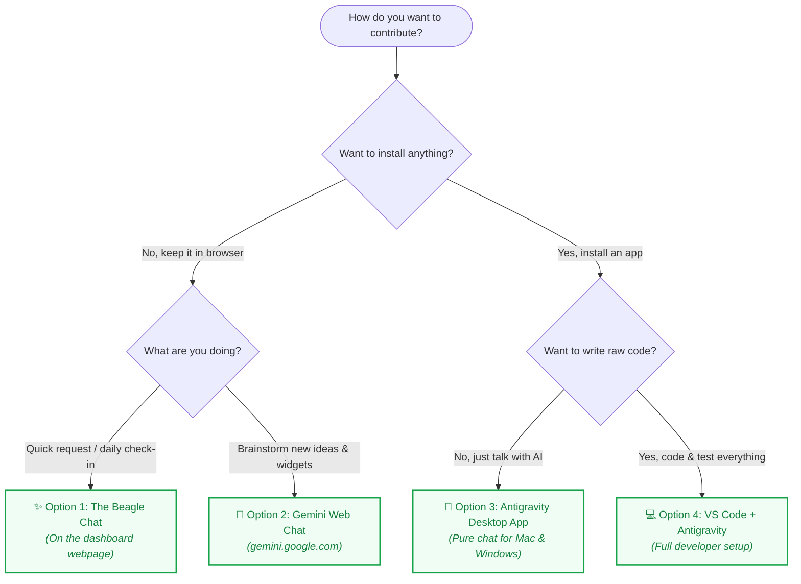

# 🌟 Swentonelli Family Dashboard

Welcome to the **Swentonelli Family Dashboard**! 🚀



---

## 🚀 We Have Many Options How to Contribute!
*(Choose the way that feels easiest and most fun for you!)*



| Option | From Where | Example Thing You Can Do | Get Started |
| :--- | :--- | :--- | :--- |
| **1. The Beagle Chat** | Directly on the dashboard webpage | *"Vote thumbs-up on Friday tacos"*, *"Scout ate breakfast"* | [Go to Option 1](#option-1-the-beagle-chat-on-the-webpage) |
| **2. Gemini Chat in Browser** | Any web browser (`gemini.google.com`) | *"Design a summer countdown widget with confetti"* | [Go to Option 2](#option-2-gemini-chat-in-browser) |
| **3. Antigravity Desktop App** | Desktop app on your Mac or PC | *"Make sports events purple and add a picture day badge"* | [Go to Option 3](#option-3-antigravity-desktop-app) |
| **4. VS Code + Antigravity** | Full developer setup on your PC | Write code, build widgets, run tests, push Git branches | [Go to Option 4](#option-4-vs-code--antigravity-full-developer) |

---

## 🛠️ Instructions

### Option 1: The Beagle Chat (On the Webpage)
* **Where to go**: Open the family dashboard on your iPad, phone, or laptop.
* **Setup required**: None!
* **Steps**:
  1. Click the **"✨ Suggest Idea / Request Change"** button on the screen.
  2. Type or speak what you'd like (e.g. *"Change my avatar"*, *"Vote for pizza on Tuesday"*).
  3. The system updates your preferences instantly.

---

### Option 2: Gemini Chat in Browser
* **Where to go**: Open [gemini.google.com](https://gemini.google.com) in any browser.
* **Setup required**: Sign in with your family Google account.
* **Steps**:
  1. Go to [gemini.google.com](https://gemini.google.com).
  2. Tell Gemini your idea:
     > *"Design a Pet Care Tracker widget for Scout for our family dashboard with checkmarks for breakfast, dinner, and walks."*
  3. Gemini creates your feature blueprint for Dad and Bennett to build!

---

### Option 3: Antigravity Desktop App

> A clean AI chat app for your computer — no code files or complex menus.

#### 🍎 Mac Instructions (because Daddy's got you baby!)
1. **Download**: **[👉 Download Antigravity for Mac (.dmg)](https://antigravity.google/download)**
2. **Install**: Drag **Antigravity** into your `Applications` folder and open it.
3. **Sign In**: Click **Sign in with Google**.
4. **Open Dashboard**: Click **Clone from GitHub / URL**, and paste:
   ```
   https://github.com/Swensation/swentonelli
   ```
5. **Chat**: Ask Antigravity for any dashboard updates you want!

#### 🪟 Windows Instructions
1. **Download**: **[👉 Download Antigravity for Windows (.exe)](https://antigravity.google/download)**
2. **Install**: Run the installer and sign in with Google.
3. **Open Dashboard**: Click **Open Project** (or **Clone from GitHub**) and select `Swensation/swentonelli`.
4. **Chat**: Type what you'd like changed and Antigravity handles the rest!

---

### Option 4: VS Code + Antigravity (Full Developer)

> For Bennett & Dad: Full code editor, Git branches, and automated tests.

#### 1-Click Windows Setup (PowerShell or Command Prompt)
Open **PowerShell** or **Command Prompt** and paste:
```powershell
irm https://raw.githubusercontent.com/Swensation/swentonelli/main/scripts/bootstrap-contributor.ps1 | iex
```

#### Handoff to Antigravity
Inside VS Code, open the **Antigravity** chat panel and paste:
> *"Please help Bennett sign up for GitHub and get able to contribute at the same level that Dad is. Configure my git identity, authenticate GitHub via `gh auth login`, verify my `.env.local` Gemini credentials, run `npm test`, and launch the server."*

---

## 👨‍💻 Admin & Verification

- **GitHub Collaborators**: Add family members at [Swensation/swentonelli Settings ➔ Collaborators](https://github.com/Swensation/swentonelli/settings/access).
- **Run Tests**: `npm test` *(156+ automated checks)*
- **Guides**: [Kids Prompting Guide](docs/KIDS_PROMPTING_GUIDE.md) | [Contributor Onboarding](docs/ONBOARDING.md) | [Architecture](docs/ARCHITECTURE.md)
