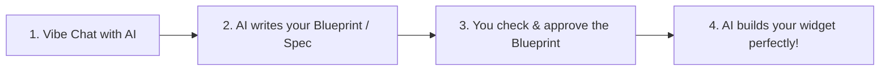

# 🚀 Kids & Family Guide: Build Widgets with Spec-Driven Design!

Welcome to the **Swentonelli Family Dashboard**! 🎉  
In software engineering, the best way to build awesome things without bugs or confusion is called **Spec-Driven Design** (we call it **Blueprint First**).

---

## 🏗️ The 4-Step Blueprint Workflow

### Step 1: Vibe Chat your Idea
Tell Antigravity what you want to build in your own words:
> *"Hey Antigravity, I want to create a Pet Care Widget that shows whether our dog was fed breakfast, lunch, and taken for a walk, with big green checkmarks and barking sound/confetti!"*

### Step 2: Antigravity writes the Blueprint (`specs/widgets/pet-care.spec.md`)
Antigravity will create a **Spec** file with:
1. **The Story**: Who uses it and why.
2. **The Look**: What colors, buttons, and icons to use on the kitchen screen and iPad.
3. **The Data**: What checkmarks and info it saves.
4. **The Checklist**: Things to test when it's done.

### Step 3: Approve or Tweak the Spec
Read through the blueprint with Dad. If you want something changed (e.g. *"Can we add a streak counter for 7 days in a row?"*), tell Antigravity to update the blueprint!

### Step 4: Watch it Get Built & Tested!
Once the blueprint is approved, Antigravity writes the code and checks every box on your checklist.

---

## 🌟 Ready-to-Use Idea Starters

- **Pet Care Tracker**: `specs/widgets/pet-care.spec.md`
- **Chore & Reward Chart**: `specs/widgets/chores.spec.md`
- **Summer / Birthday Countdown**: `specs/widgets/countdown.spec.md`
- **Family Weather & Outfit Advisor**: `specs/widgets/weather.spec.md`
- **Lunch Menu Voting / Thumbs Up**: Update `specs/widgets/school-lunch.spec.md`

All widget blueprints live in the [`specs/widgets/`](file:///c:/Users/aswenson/personal/swentonelli/specs/widgets/) folder!
