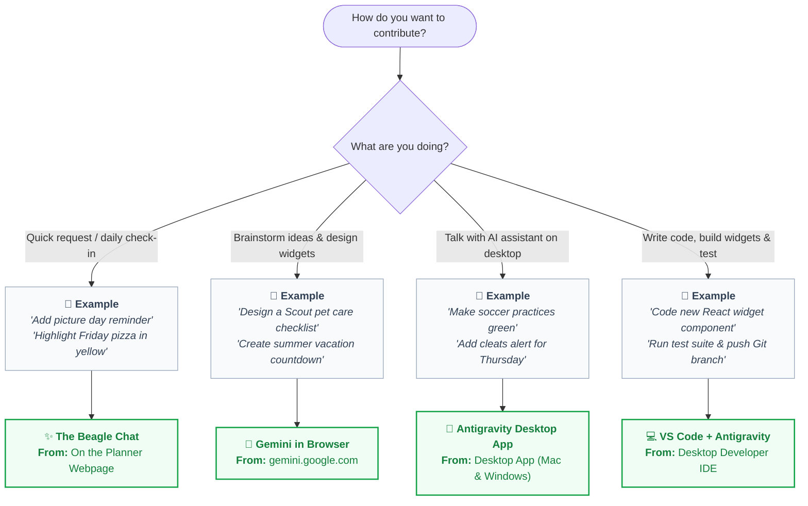

# 👨‍👩‍👧‍👦 Family Contributor Onboarding Guide

Welcome to the **Swentonelli Family Engineering Team**! 🚀  

---

## 🚀 We Have Many Options How to Contribute!



---

## 🛠️ Contribution Pathways

### ✨ The Beagle Chat
* **From**: On the Planner (`http://localhost:3000` or deployed screen).
* **Capability**: Send feature requests directly from the dashboard. AI attempts automatic implementation or funnels the request to Dad.
* **How to use**:
  1. Click the **"✨ Suggest Idea / Request Change"** button on the screen.
  2. Type or voice-record your request.
  3. The system updates your preferences or queues the feature.

> 💬 **Example:** *"Add a reminder badge for school picture day on Tuesday"* or *"Highlight Friday pizza days in yellow"*.

---

### 💬 Gemini in Browser
* **From**: [gemini.google.com](https://gemini.google.com) (in any browser, logged into your family Google account).
* **Capability**: Brainstorm ideas and have AI draft complete, structured feature blueprints and widget specs.
* **How to use**:
  1. Open [gemini.google.com](https://gemini.google.com).
  2. Describe your feature idea.
  3. Gemini writes a complete blueprint spec for Dad and Bennett to build into the dashboard.

> 💬 **Example:** *"Design a Scout Pet Care Tracker widget for our family dashboard with checkmarks for breakfast, dinner, and walks."*

---

### 🤖 Antigravity Desktop App
* **From**: Desktop App on your Mac or Windows PC.
* **Capability**: Clean, conversational AI workspace connected directly to the repository — zero code clutter, zero terminal.

#### 🍎 Mac Instructions (because Daddy's got you baby!)
1. **Download**: **[👉 Download Antigravity for Mac (.dmg)](https://antigravity.google/download)**
2. **Install**: Drag **Antigravity** into `Applications` and open it.
3. **Sign In**: Click **Sign in with Google**.
4. **Open Dashboard**: Click **Clone from GitHub / URL**, paste:
   ```
   https://github.com/Swensation/swentonelli
   ```
5. **Chat**: Ask Antigravity for any dashboard updates you want!

#### 🪟 Windows Instructions
1. **Download**: **[👉 Download Antigravity for Windows (.exe)](https://antigravity.google/download)**
2. **Install**: Run the installer and sign in with Google.
3. **Open Dashboard**: Click **Open Project** and select `Swensation/swentonelli`.
4. **Chat**: Type what you'd like changed and Antigravity handles the rest!

> 💬 **Example:** *"Make all soccer practice events green, and add an alert for field hockey uniform on Thursday."*

---

### 💻 VS Code + Antigravity
* **From**: Desktop Developer IDE on Windows PC.
* **Capability**: Full developer toolchain for writing React components, adding APIs, running automated test suites, and pushing Git branches.
* **How to use**:
  1. **1-Click Setup**: Open PowerShell or Command Prompt and run:
     ```powershell
     irm https://raw.githubusercontent.com/Swensation/swentonelli/main/scripts/bootstrap-contributor.ps1 | iex
     ```
  2. **Antigravity Handoff**: Inside VS Code, open the **Antigravity** chat panel and paste:
     > *"Please help Bennett sign up for GitHub and get able to contribute at the same level that Dad is. Configure my git identity, authenticate GitHub via gh auth login, verify my .env.local Gemini credentials, run npm test, and launch the server."*

> 💬 **Example:** Building new widgets, modifying custody algorithms, running `npm test`, and submitting pull requests.

---

## 👨‍💻 Admin & Verification

- **GitHub Collaborators**: Add family members at [Swensation/swentonelli Settings ➔ Collaborators](https://github.com/Swensation/swentonelli/settings/access).
- **Run Tests**: `npm test` *(156+ automated checks)*
- **Guides**: [Kids Prompting Guide](KIDS_PROMPTING_GUIDE.md) | [Architecture](ARCHITECTURE.md)
