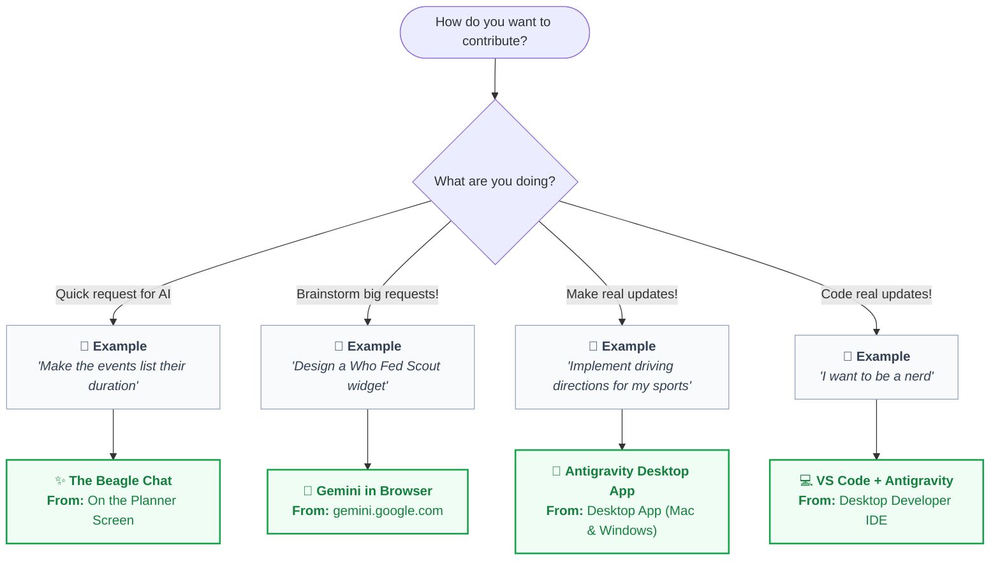

# 👨‍👩‍👧‍👦 Family Contributor Onboarding Guide

Welcome to the **Swentonelli Family Engineering Team**! 🚀  

---

## 🚀 We Have Many Options How to Contribute!



---

## 🛠️ How to Use

### ✨ The Beagle Chat
1. Click **"✨ Suggest Idea / Request Change"** on the planner screen.
2. Type or voice-record your request (e.g. *"Make the events list their duration"*).
3. The AI attempts to make the change automatically or sends it to Dad for review.

---

### 💬 Gemini in Browser
1. Open **[gemini.google.com](https://gemini.google.com)** in any browser.
2. Ask Gemini to design your feature:
   > *"Design a Who Fed Scout widget for our family dashboard with checkmarks for breakfast, dinner, and walks."*
3. Share the blueprint with Dad and Bennett to build it into the dashboard!

---

### 🤖 Antigravity Desktop App

#### Step 1: Install the App
* **🍎 Mac (because Daddy's got you baby!)**: **[👉 Download Antigravity for Mac (.dmg)](https://antigravity.google/download)** — Drag into `Applications` and open.
* **🪟 Windows**: **[👉 Download Antigravity for Windows (.exe)](https://antigravity.google/download)** — Run the installer and open.

#### Step 2: Open & Chat
1. **Sign In**: Click **Sign in with Google**.
2. **Open Project**: Click **Clone from GitHub / URL** (or **Open Project**) and paste:
   ```
   https://github.com/Swensation/swentonelli
   ```
3. **Chat**: Ask Antigravity for any updates (e.g. *"Implement driving directions for my sports"*).

---

### 💻 VS Code + Antigravity
1. **1-Click Setup**: Run in PowerShell or Command Prompt:
   ```powershell
   irm https://raw.githubusercontent.com/Swensation/swentonelli/main/scripts/bootstrap-contributor.ps1 | iex
   ```
2. **Handoff**: Inside VS Code Antigravity chat, paste:
   > *"Please help Bennett sign up for GitHub and get able to contribute at the same level that Dad is. Configure my git identity, authenticate GitHub via gh auth login, verify my .env.local Gemini credentials, run npm test, and launch the server."*


