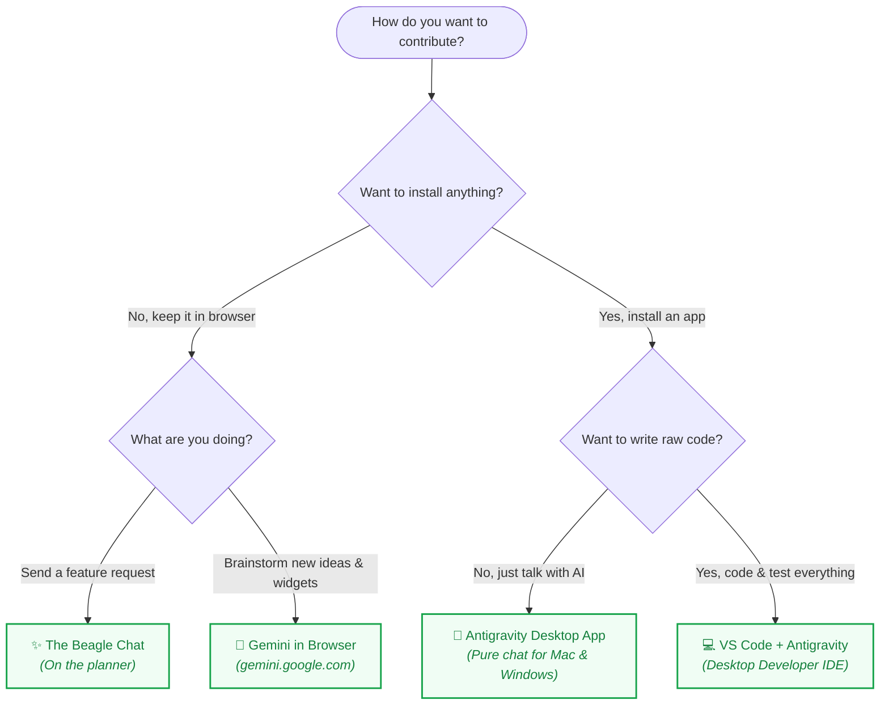

# 👨‍👩‍👧‍👦 Family Contributor Onboarding Guide

Welcome to the **Swentonelli Family Engineering Team**! 🚀  

---

## 🚀 We Have Many Options How to Contribute!



| Option | From | Capability | Example |
| :--- | :--- | :--- | :--- |
| **[The Beagle Chat](#the-beagle-chat)** | On the Planner | Send feature requests directly; AI attempts automatic implementation or funnels to Dad | *"Add a reminder badge for picture day"*, *"Highlight Friday pizza days in yellow"* |
| **[Gemini in Browser](#gemini-in-browser)** | [Gemini in Browser](https://gemini.google.com) | Brainstorm and draft complete feature blueprints & specs | *"Design a summer countdown widget with confetti"* |
| **[Antigravity Desktop App](#antigravity-desktop-app)** | Desktop App | Conversational AI workspace on your Mac or PC with zero code clutter | *"Make soccer events green and adjust the timeline layout"* |
| **[VS Code + Antigravity](#vs-code--antigravity)** | Desktop Developer IDE | Full code editing, automated test suite verification, and Git branches | Write React components, add backend APIs, run test suites |

---

## 🛠️ Instructions

### The Beagle Chat
* **From**: Right on the live family planner webpage.
* **How it works**:
  1. Click the **"✨ Suggest Idea / Request Change"** button on the planner screen.
  2. Type or voice-record your feature request.
  3. Our autonomous AI pipeline attempts to implement and test the change automatically, or funnels the request to Dad if human approval is needed.

---

### Gemini in Browser
* **From**: [gemini.google.com](https://gemini.google.com) in any browser (logged into your family Google account).
* **How it works**:
  1. Open [gemini.google.com](https://gemini.google.com).
  2. Describe your idea:
     > *"Design a Pet Care Tracker widget for Scout for our family dashboard with checkmarks for breakfast, dinner, and walks."*
  3. Gemini drafts a structured blueprint spec for Dad and Bennett to build into the dashboard.

---

### Antigravity Desktop App

> A clean AI chat app for your computer — no code files or complex menus.

#### 🍎 Mac Instructions (because Daddy's got you baby!)
1. **Download**: **[👉 Download Antigravity for Mac (.dmg)](https://antigravity.google/download)**
2. **Install**: Drag **Antigravity** into your `Applications` folder and open it.
3. **Sign In**: Click **Sign in with Google**.
4. **Open Dashboard**: Click **Clone from GitHub / URL**, and paste:
   ```
   https://github.com/Swensation/swentonelli
   ```
5. **Chat**: Ask Antigravity for any dashboard updates you want!

#### 🪟 Windows Instructions
1. **Download**: **[👉 Download Antigravity for Windows (.exe)](https://antigravity.google/download)**
2. **Install**: Run the installer and sign in with Google.
3. **Open Dashboard**: Click **Open Project** (or **Clone from GitHub**) and select `Swensation/swentonelli`.
4. **Chat**: Type what you'd like changed and Antigravity handles the rest!

---

### VS Code + Antigravity

> Full developer toolchain for Bennett & Dad with live code editor, Git branches, and automated tests.

#### 1-Click Windows Setup (PowerShell or Command Prompt)
Open **PowerShell** or **Command Prompt** and paste:
```powershell
irm https://raw.githubusercontent.com/Swensation/swentonelli/main/scripts/bootstrap-contributor.ps1 | iex
```

#### Handoff to Antigravity
Inside VS Code, open the **Antigravity** chat panel and paste:
> *"Please help Bennett sign up for GitHub and get able to contribute at the same level that Dad is. Configure my git identity, authenticate GitHub via `gh auth login`, verify my `.env.local` Gemini credentials, run `npm test`, and launch the server."*

---

## 👨‍💻 Admin & Verification

- **GitHub Collaborators**: Add family members at [Swensation/swentonelli Settings ➔ Collaborators](https://github.com/Swensation/swentonelli/settings/access).
- **Run Tests**: `npm test` *(156+ automated checks)*
