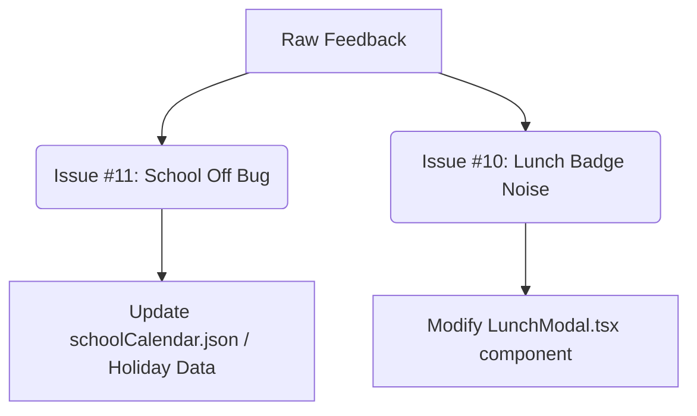

# Beagle Batch Feedback Proposal (8/29/2026)

> Triaged from Issues: #11, #10

# Beagle Triage Report & Implementation Proposal

**Date:** August 29, 2026  
**Reporter:** Beagle Triage Agent  
**Dashboard:** Scouty Planner (`https://swentonelli--scouty-planner.us-east4.hosted.app/`)

---

## 1. Deduplication & Noise Filter
A review of the incoming stream indicates that **both Issue #10 and Issue #11 are legitimate, actionable items** from active family users. There are no test logs or duplicated submissions. Both items will proceed to the Implementation Proposal phase.

---

## 2. Clustered Issues & Root Cause Analysis

### Cluster A: School Schedules & Calendar Rules (Issue #11)
*   **User Complaint**: For September 3, 2026 (Thursday) and September 4, 2026 (Friday), the system incorrectly indicates all kids have school off. 
    *   *Correction*: Thursday, Sept 3 is a regular school day for everyone. Friday, Sept 4 is *only* a day off for Aria and Benjamin (Millis School District). Brighton and Bennett (Holliston School District) still have school.
*   **Root Cause**: The application's underlying calendar/holiday engine applied a generic "School Off" event to all children on both Sept 3 and Sept 4, failing to distinguish between school districts (Millis vs. Holliston) and incorrectly flagging Thursday.

### Cluster B: Lunch Pop-Up UI (Issue #10)
*   **User Complaint**: The "Lunch Pop-up" modal displays unnecessary dietary badges, specifically pointing out items like "Vegetarian". The family does not need to see these badges.
*   **Root Cause**: The lunch detail component is rendering tags/badges parsed from the school menu API/JSON (e.g., `Vegetarian`, `Vegan`, `Gluten-Free`) unconditionally.

---

## 3. Implementation Proposals



### [Proposal A] School Holiday & District Alignment (Issue #11)

#### Technical Scope
We must isolate the holiday calendar configurations and apply district-specific filters to the events on Sept 3 and Sept 4, 2026. 
*   **Aria & Benjamin**: Millis District (Millis Middle & CFB Millis).
*   **Brighton & Bennett**: Holliston District (Adams Middle & Miller Holliston).

#### Files to Inspect/Modify
*   `src/data/schoolCalendar.json` (or any equivalent static database file defining holiday rules)
*   `src/utils/calendarHelpers.ts` (or wherever holiday/no-school events are dynamically calculated)

#### Proposed Code/Data Fix
1.  **Remove** any "School Off" holiday event definition mapped to September 3, 2026 (`2026-09-03`).
2.  **Refactor** the September 4, 2026 (`2026-09-04`) "School Off" entry to explicitly target the `Millis` school district only.

*Example Data Structure Adjustments:*
```json
// Before
{
  "date": "2026-09-03",
  "title": "School Off",
  "appliesTo": "all"
},
{
  "date": "2026-09-04",
  "title": "School Off",
  "appliesTo": "all"
}

// After
// (Sept 3 entry completely removed or disabled)
{
  "date": "2026-09-04",
  "title": "Professional Development Day / School Off",
  "appliesTo": ["Millis"] 
}
```

#### Verification Steps
1. Navigate to the calendar schedule view for **September 3, 2026**. Verify all four children (Aria, Benjamin, Brighton, Bennett) show normal school hours.
2. Navigate to **September 4, 2026**. Verify Aria and Benjamin display "School Off / Millis Off" tags, while Brighton and Bennett display normal school session logs.

---

### [Proposal B] Remove Dietary Badges in Lunch Pop-Up (Issue #10)

#### Technical Scope
Streamline the lunch detail modal display by hiding tags/labels that indicate dietary classifications (e.g. `Vegetarian`, `V`, `GF`).

#### Files to Inspect/Modify
*   `src/components/LunchPopup.tsx` (or `src/components/LunchModal.tsx`)
*   `src/components/ui/LunchDetailCard.tsx`

#### Proposed Code/Data Fix
Identify where dietary badges are rendered within the component and either remove them completely or add a conditional flag if other schools/families need them (though for this dedicated family dashboard, clean removal is requested).

```tsx
// Before
return (
  <div className="lunch-popup">
    <h3>{lunchItem.name}</h3>
    <div className="flex gap-2 my-1">
      {lunchItem.dietaryTags.map(tag => (
        <span className="badge badge-green" key={tag}>{tag}</span>
      ))}
    </div>
  </div>
);

// After (Dietary badges stripped out to reduce clutter)
return (
  <div className="lunch-popup">
    <h3 className="text-lg font-semibold">{lunchItem.name}</h3>
    {/* Dietary tags element completely removed */}
  </div>
);
```

#### Verification Steps
1. Click on any lunch menu item in the planner to open the detail pop-up modal.
2. Confirm that names like "Cheese Pizza" or "Veggie Wrap" do not display adjacent "Vegetarian" badges.
