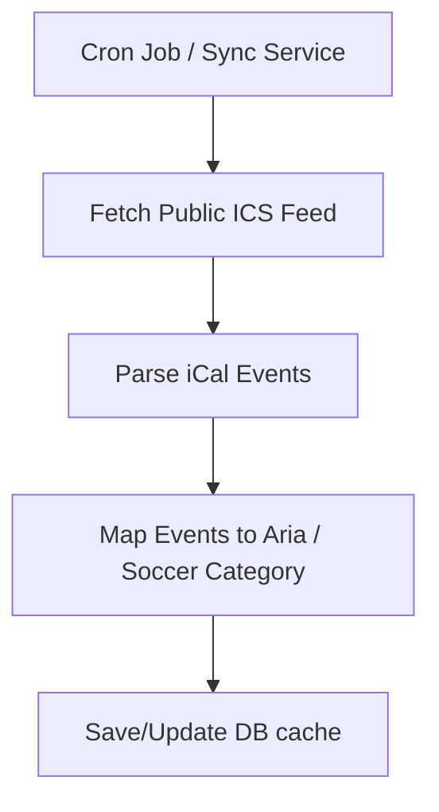

# Beagle Triage Report & Implementation Proposal

- [ ] **Ready to execute**: Check this box to start autonomous implementation

> Triaged from Issues: #26

### Deduplication & Noise Filter

- **Issue #26**: **Valid & Actionable**. This is a direct request from Andrew ("aswens") to integrate an external Google Calendar for Aria's soccer team (**OSFC Girls U13**) into the family planner dashboard.

---

### Clustered Proposals

#### Calendar & Activities

##### Integration of "OSFC Girls U13" Soccer Calendar
* **Description**: Andrew requested the integration of an external Google Calendar for the "OSFC Girls U13" soccer team. This corresponds to Aria (7th Grade, Millis Middle, Soccer).
* **Source URL**: `https://calendar.google.com/calendar/embed?src=dno68vgi29lj52e9rg29ubn2dv3i3bri%40import.calendar.google.com&ctz=America%2FNew_York`
* **Target Calendar ID**: `dno68vgi29lj52e9rg29ubn2dv3i3bri@import.calendar.google.com`
* **Target ICS/iCal URL**: `https://calendar.google.com/calendar/ical/dno68vgi29lj52e9rg29ubn2dv3i3bri%40import.calendar.google.com/public/basic.ics`

---

### Proposed Action Items

#### Technical Implementation: External Calendar Sync



##### 1. Files to Inspect/Modify
* **`src/config/calendars.ts` (or database configuration)**: Add the new feed configuration.
  ```typescript
  export const EXTERNAL_FEEDS = [
    {
      id: 'aria-osfc-soccer',
      name: 'OSFC Girls U13',
      url: 'https://calendar.google.com/calendar/ical/dno68vgi29lj52e9rg29ubn2dv3i3bri%40import.calendar.google.com/public/basic.ics',
      owner: 'Aria',
      color: '#FF5733', // Match soccer/Aria's specific theme color
      type: 'sport'
    }
  ];
  ```
* **`src/services/calendarSync.ts` (or equivalent parser service)**:
  * Ensure the parser can fetch and handle Google Calendar public ICS URLs.
  * Map imported events so that any incoming item from this feed automatically tags **Aria** as the attendee and displays the **Soccer** activity icon.

##### 2. Verification Steps
1. **Fetch Validation**: Curl the generated ICS URL (`https://calendar.google.com/calendar/ical/...`) to verify that the feed is public and returns valid iCalendar data format.
2. **Local Run**: Execute the calendar synchronization script locally:
   ```bash
   npm run sync:calendars
   ```
3. **UI Check**: Verify that upcoming practices/games for **OSFC Girls U13** render on the main dashboard view under the correct date, displaying Aria's avatar or her designated color/soccer badge.

> [!NOTE]
> Since this feed is labeled `@import.calendar.google.com`, it is likely an external subscription (e.g., from a league management site like GotSport or SportsEngine) that Andrew imported into his Google Calendar. Subscribing directly to the ICS url guarantees realtime schedule updates.

---
