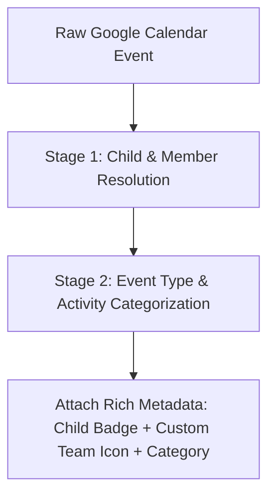

# Spec: Calendar Event Categorization & Child Rules Engine

> **Status**: Approved / In Progress  
> **Author**: Dad (Andrew)  
> **Last Updated**: 2026-08-24  

---

## 1. Purpose & Business Rules Engine
When calendar events are ingested from any Google Calendar feed, the dashboard runs a 2-stage business rules engine to enrich the event before presentation:

---

## 2. Stage 1: Child Resolution
The engine matches event summary, description, and source feed to determine which family member it belongs to:
- **Aria**: Matches `"Aria"`, `"Aria's"`, or Aria's specific activities (OSFC Soccer, Bishop Feehan, etc.).
- **Brighton**: Matches `"Brighton"`, `"Brighton's"`, Field Hockey, Patoma, Katie Pellegri meet-and-greet, etc.
- **Benjamin**: Matches `"Benjamin"`, `"Ben"`, `"Ben's"`.
- **Bennett**: Matches `"Bennett"`, `"Bennett's"`.
- **Dad (Andrew)**: Matches `"Andrew"`, `"Dad"`.
- **Mom (Liz)**: Matches `"Liz"`.

---

## 3. Stage 2: Activity & Icon Rules (`config/event_rules.json`)
Specific activities attach high-res team crests, activity icons, and category badges:

### Example: Aria • OSFC Soccer ⚽
- **Child**: `Aria` (Color: `#3b82f6` / `#60a5fa`)
- **Matching Rules**:
  - Summary contains `OSFC` or `old school` (case-insensitive)
  - OR Description contains `old school football club` or `teamsnapone.com` for OSFC
- **Category**: `OSFC Soccer`
- **Badge Text**: `OSFC U13 Girls`
- **Icon URL**: `/icons/teams/osfc.png`

---

## 4. UI Presentation Contract (`EventItem.tsx`)
1. **Title & Timing**: Keep existing event title, start/end time, and location chips.
2. **Team / Activity Crest**: If `iconUrl` is present, display a high-resolution rounded logo avatar (`w-10 h-10 rounded-xl bg-white/10 p-1 border border-slate-700`).
3. **Child & Activity Badge**: Display a pill badge showing the child's name and team/activity (e.g. `[ ⚽ Aria • OSFC U13 ]`).
